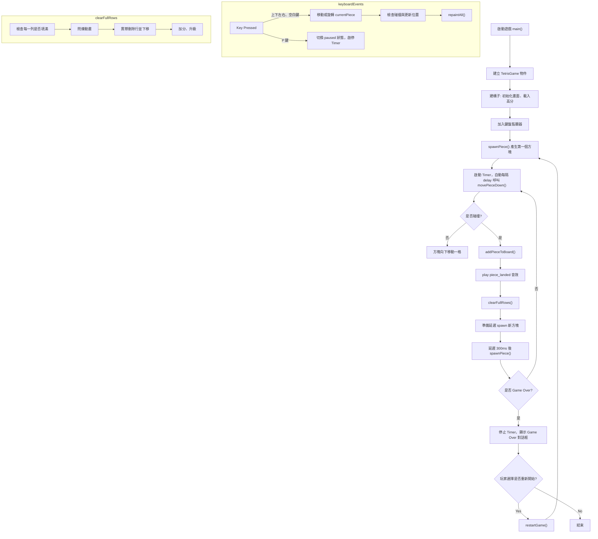

```mermaid
flowchart TD
    A["啟動遊戲 main()"] --> B["建立 TetrisGame 物件"]
    B --> C["建構子: 初始化畫面、載入高分"]
    C --> D["加入鍵盤監聽器"]
    D --> E["spawnPiece() 產生第一個方塊"]
    E --> F["啟動 Timer，自動每隔 delay 呼叫 movePieceDown()"]

    subgraph keyboardEvents
        K1["Key Pressed"] --> |上下左右、空白鍵| K2["移動或旋轉 currentPiece"]
        K2 --> K3["檢查碰撞與更新位置"]
        K3 --> K4["repaintAll()"]
        K1 --> |P 鍵| K5["切換 paused 狀態，啟停 Timer"]
    end

    F --> G{是否碰撞?}
    G --> |否| H["方塊向下移動一格"]
    G --> |是| I["addPieceToBoard()"]
    I --> J["play piece_landed 音效"]
    J --> K["clearFullRows()"]
    K --> L["準備延遲 spawn 新方塊"]

    L --> M["延遲 300ms 後 spawnPiece()"]
    M --> N{是否 Game Over?}
    N --> |否| F
    N --> |是| O["停止 Timer，顯示 Game Over 對話框"]

    O --> P{玩家選擇是否重新開始?}
    P --> |Yes| Q["restartGame()"]
    Q --> E
    P --> |No| R["結束"]

    subgraph clearFullRows
        K1c["檢查每一列是否填滿"] --> K2c["閃爍動畫"]
        K2c --> K3c["實際刪除行並下移"]
        K3c --> K4c["加分、升級"]
    end

```