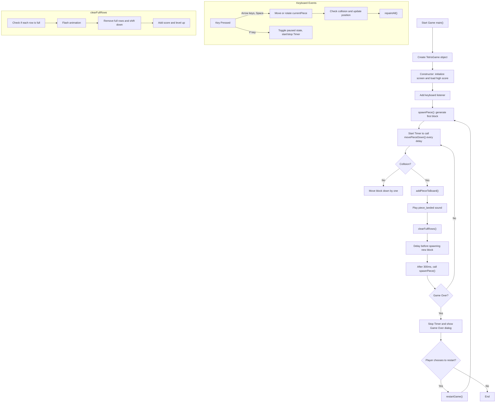

```mermaid
flowchart TD
    A["Start Game main()"] --> B["Create TetrisGame object"]
    B --> C["Constructor: initialize screen and load high score"]
    C --> D["Add keyboard listener"]
    D --> E["spawnPiece(): generate first block"]
    E --> F["Start Timer to call movePieceDown() every delay"]

    subgraph Keyboard Events
        K1["Key Pressed"] --> |Arrow keys, Space| K2["Move or rotate currentPiece"]
        K2 --> K3["Check collision and update position"]
        K3 --> K4["repaintAll()"]
        K1 --> |P key| K5["Toggle paused state, start/stop Timer"]
    end

    F --> G{Collision?}
    G --> |No| H["Move block down by one"]
    G --> |Yes| I["addPieceToBoard()"]
    I --> J["Play piece_landed sound"]
    J --> K["clearFullRows()"]
    K --> L["Delay before spawning new block"]

    L --> M["After 300ms, call spawnPiece()"]
    M --> N{Game Over?}
    N --> |No| F
    N --> |Yes| O["Stop Timer and show Game Over dialog"]

    O --> P{Player chooses to restart?}
    P --> |Yes| Q["restartGame()"]
    Q --> E
    P --> |No| R["End"]

    subgraph clearFullRows
        K1c["Check if each row is full"] --> K2c["Flash animation"]
        K2c --> K3c["Remove full rows and shift down"]
        K3c --> K4c["Add score and level up"]
    end

```
