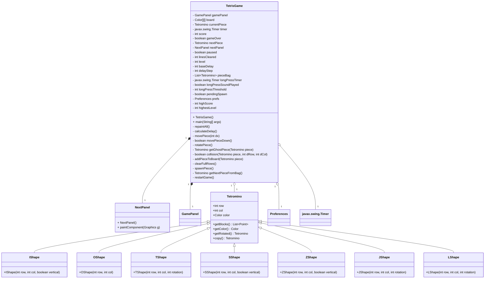

 # 2025 Java俄羅斯方塊
- 學號：B11207034
- 姓名：范雲翔
- 工作說明：整體遊戲製作
    - 方塊墜落、旋轉
    - 鬼影
    - 消除
    - 預覽窗格
    - 分數機制
    - 難度機制
  ## 遊戲說明
- **共7種方塊**
- **加入鬼影**
- 操作說明：
1. 移動方塊：`←`、`→`
2. 旋轉方塊：`↑`
3. 軟降：`↓`
4. 硬降：`space`
5. 暫停/繼續：`P`
- 下墜速度機制：每消除10行方塊，提升一個等級。
- 分數機制：每消除1行→(當前等級+1)*40分  
           每消除2行→(當前等級+1)*100分  
           每消除3行→(當前等級+1)*300分  
           每消除4行→(當前等級+1)*1200分  
## 執行檔說明
點擊執行TetrisGame.jar即可開始遊玩
## 影片、簡報
[影片連結](https://youtu.be/cxrXp0DB0IQ)  
[簡報連結](https://www.canva.com/design/DAGoenGEhiU/hIwzYMSE3-XANpvIaQGJ2Q/edit?utm_content=DAGoenGEhiU&utm_campaign=designshare&utm_medium=link2&utm_source=sharebutton)
# 流程圖

# UML類別圖

# 時序圖

